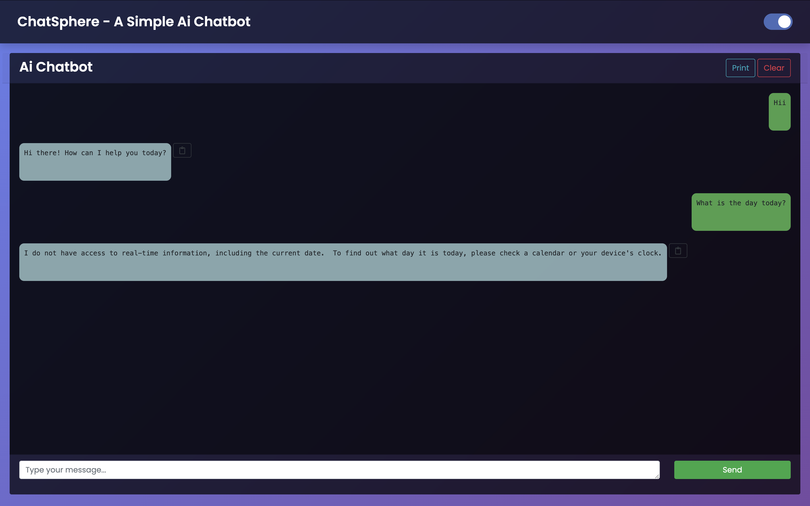

# ChatSphere - A Simple AI Chatbot

ChatSphere is a lightweight, user-friendly AI chatbot powered by the Gemini API. It provides a seamless conversational experience with a modern and responsive design. Whether you're looking to integrate AI into your projects or just want to explore chatbot functionality, ChatSphere is the perfect starting point.

[Live Demo](https://nouzen-shinei.github.io/Ai-ChatBot/) <!-- Replace with your live demo link -->

---

## Features

- **AI-Powered Conversations**: Powered by the Gemini API for intelligent and dynamic responses.
- **Modern UI**: Clean and responsive design with a beautiful gradient background.
- **Dark Mode**: Toggle between light and dark themes for a comfortable viewing experience.
- **Markdown Support**: Renders messages in Markdown format for rich text display.
- **Copy to Clipboard**: Easily copy chatbot responses with a single click.
- **Responsive Design**: Works seamlessly on desktop, tablet, and mobile devices.

---

## Live Demo

Check out the live demo of ChatSphere:  
👉 [ChatSphere Live Demo](https://nouzen-shinei.github.io/Ai-ChatBot/) <!-- Replace with your live demo link -->

---

## Screenshots

| Light Mode | Dark Mode |
|------------|-----------|
|  |  | <!-- Replace with actual screenshots -->

---

## Getting Started

### Prerequisites

- A Gemini API key. You can get one from [Google Cloud Console](https://aistudio.google.com/apikey).
- A basic understanding of HTML, CSS, and JavaScript.

### Installation

1. **Clone the Repository**:
   ```bash
   git clone https://github.com/your-username/ChatSphere.git
   cd ChatSphere
   ```

2. **Add Your API Key**:
   Replace the placeholder API key in the `script` section of the `index.html` file with your Gemini API key:
   ```javascript
   const geminiApiKey = "YOUR_GEMINI_API_KEY_HERE";
   ```

3. **Run the Project**:
   Open the `index.html` file in your browser, or use a local server like [Live Server](https://marketplace.visualstudio.com/items?itemName=ritwickdey.LiveServer) for a better experience.

---

## Usage

1. **Type Your Message**: Enter your message in the input box and press `Enter` or click the `Send` button.
2. **Toggle Dark Mode**: Use the toggle switch in the top-right corner to switch between light and dark themes.
3. **Copy Responses**: Click the copy icon next to the chatbot's response to copy it to your clipboard.
4. **Clear Chat**: Use the `Clear` button to reset the chat history.
5. **Print Chat**: Use the `Print` button to print the chat responses.

---

## Technologies Used

- **Frontend**: HTML, CSS, JavaScript
- **API**: [Gemini API](https://aistudio.google.com/)
- **Libraries**:
  - [Bootstrap](https://getbootstrap.com/) for styling.
  - [Markdown-it](https://github.com/markdown-it/markdown-it) for Markdown rendering.
  - [CryptoJS](https://github.com/brix/crypto-js) for generating unique IDs.

---

## Contributing

Contributions are welcome! If you'd like to contribute to ChatSphere.

---

## License

This project is licensed under the MIT License. See the [LICENSE](LICENSE) file for details.

---

## Acknowledgments

- Thanks to [Google Gemini](https://ai.google.dev/) for providing the AI API.
- Inspired by modern chatbot designs and open-source projects.

---

Enjoy using ChatSphere! 🚀
```
